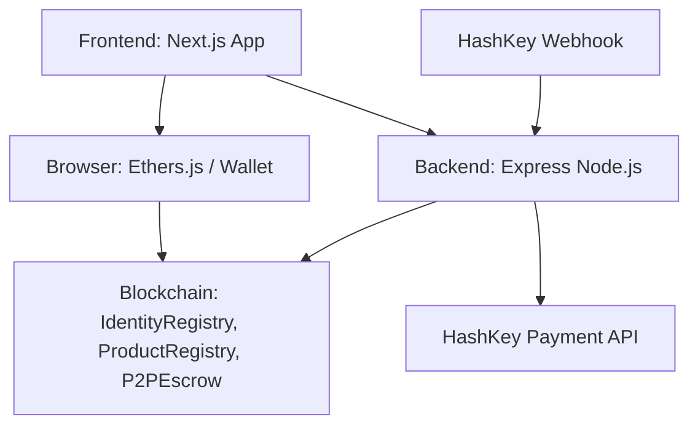
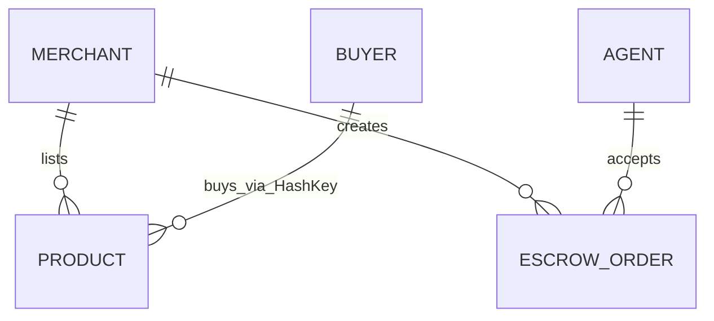

## 1. Architecture Design

## 2. Technology Description
- **Frontend**: Next.js 14 (App Router) + Tailwind CSS + TypeScript + Ethers.js v6
- **Initialization Tool**: `create-next-app`
- **UI Components**: Shadcn UI (or custom Tailwind components using provided CSS variables)
- **Cryptography**: SnarkJS (for local browser ZK proof generation)

## 3. Route Definitions
| Route | Purpose |
|-------|---------|
| `/` | Storefront marketplace showing listed items |
| `/kyc` | ZK-proof generation and Identity NFT minting |
| `/merchant` | Dashboard to list products and cash out via Escrow |
| `/agent` | P2P Dashboard to accept Escrow orders |
| `/success` | Return URL after HashKey payment |

## 4. API Definitions (Frontend to Backend)
### 4.1 Create Payment
- **Method**: POST
- **Endpoint**: `/api/payment/create` (hits backend server)
- **Payload**: `{ productId: number, amount: string, merchantWallet: string, productName: string, buyerWallet: string }`
- **Response**: `{ success: boolean, checkoutUrl: string, orderId: string }`

## 5. Smart Contract Integration
- **IdentityRegistry**:
  - `verifyAndMint(a, b, c, input)` (write)
  - `getUserRole(address)` (read)
- **ProductRegistry**:
  - `listProductWithStock(price, metadata, stock)` (write)
  - `products(uint256)` (read)
- **P2PEscrow**:
  - `createOrder(amount)` (write)
  - `acceptOrder(orderId)` (write)
  - `releaseFunds(orderId)` (write)
  - `orders(uint256)` (read)

## 6. Data Model
Frontend relies on smart contract state and backend mock database.
No persistent frontend DB required.
