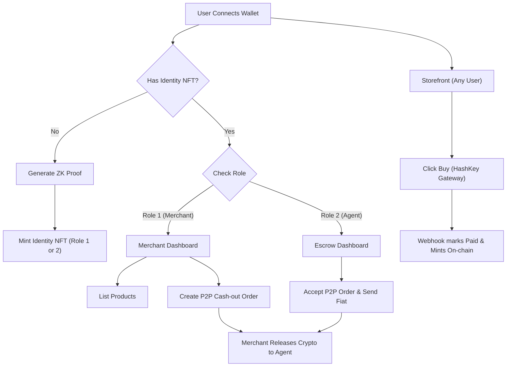

## 1. Product Overview
HashBazaar is a decentralized e-commerce and P2P crypto-to-fiat offramp marketplace powered by HashKey's payment infrastructure. 
- Main purposes: Enable merchants to list items, buyers to purchase them using HashKey, and a P2P Escrow mechanism to cash out crypto earnings.
- Target users: Web3 merchants, crypto buyers, and P2P fiat-to-crypto agents.

## 2. Core Features

### 2.1 User Roles
| Role | Registration Method | Core Permissions |
|------|---------------------|------------------|
| Buyer (Unverified) | Connect Wallet (MetaMask) | Browse products, buy items via HashKey checkout |
| Merchant (Role 1) | Submit ZK KYC Proof | List products, manage inventory, create Escrow cash-out orders |
| P2P Agent (Role 2)| Submit ZK KYC Proof | Accept Escrow orders, process fiat off-chain, earn crypto |

### 2.2 Feature Module
1. **Landing/KYC Page**: Wallet connection, role selection, ZK-proof generation and Identity NFT minting.
2. **Storefront**: Grid of active products, "Buy" buttons redirecting to HashKey.
3. **Merchant Dashboard**: Product listing form, sales metrics, Escrow creation interface.
4. **P2P Escrow Board**: List of open merchant cash-out orders, "Accept" functionality for Agents.

### 2.3 Page Details
| Page Name | Module Name | Feature description |
|-----------|-------------|---------------------|
| Home / Storefront | Product Grid | Displays active items from ProductRegistry. Calls `/api/payment/create` |
| Identity / KYC | Mint Module | Generates ZK proof locally, calls `IdentityRegistry.verifyAndMint` |
| Merchant Dashboard| Inventory Manager | Calls `ProductRegistry.listProductWithStock` |
| Escrow Board | P2P Orders | Calls `P2PEscrow.createOrder`, `acceptOrder`, `releaseFunds` |

## 3. Core Process
The application guides users through authentication, KYC verification, product listing, purchasing, and fiat offramping.

## 4. User Interface Design
### 4.1 Design Style
- **Typography**: "SF Pro Display", system-ui, sans-serif
- **Primary Color**: #0084ff (Bright Blue for CTAs and highlights)
- **Secondary Color**: #d3eec9 (Soft Green for success states / badges)
- **Tertiary / Background**: #fff (Clean white background)
- **Foreground**: #252f2c (Dark slate for primary text)
- **Surface**: #f4faef (Very light green tint for cards/containers)
- **Surface Strong**: #e8f6e0 (Stronger green tint for active states/hover)
- **Border**: #252f2c1f (Subtle dark borders)
- **Muted Text**: #252f2cb8 (Muted slate for secondary text)
- **Overall Feel**: Modern, crisp, fintech-inspired minimalism similar to `docs.tryclink.com`. Generous whitespace, subtle rounded corners, and clear typographic hierarchy.

### 4.2 Page Design Overview
| Page Name | Module Name | UI Elements |
|-----------|-------------|-------------|
| Layout | Navbar | Sticky top, bold logo, wallet connect button (pill shape, primary color) |
| Storefront| Product Cards | Surface background, subtle border, primary colored "Buy" button |
| KYC Page | Verification Box| Surface-strong background, clear typography, disabled states until proof generated |

### 4.3 Responsiveness
Desktop-first layout scaling down gracefully to mobile. Card grids transition from 3-columns to 1-column. Navigation collapses into a hamburger menu. Touch targets on mobile are large and accessible.